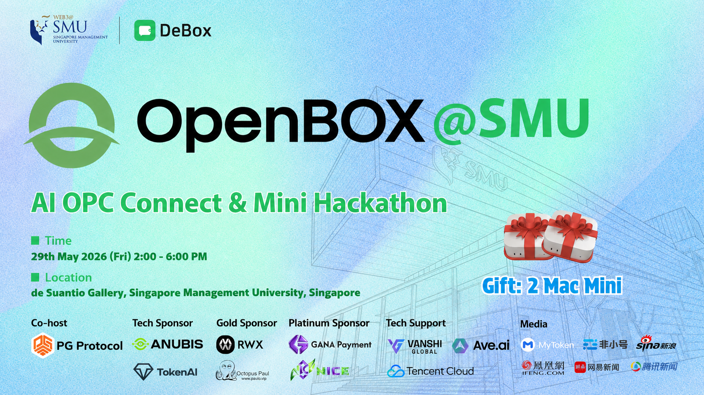

# OpenBOX @ SMU OPC Connect 2026

This repository stores public event data for OpenBOX @ SMU: Web3 & AI OPC Connect.

The website reads approved data from this repository after pull requests are reviewed and merged.
## 01 | Registration Tutorial

**Registration**

[Register Here ➡️](https://github.com/CasualHackathon/SPARK-AI-Hackathon/issues/new?template=register.md)

[Submit Project ➡️](https://openbox.fund/event-smu.html)

**Registration Tutorial**

[Full Video Tutorial 🎥](https://hackathon.draken-eth.cc.cd/demo.mp4)

## 02 | Important Notes

1. Modifying other participants' information is strictly prohibited.
2. **You must complete your registration on the [Luma event page](https://luma.com/p476hjd5) before signing up for the hackathon; otherwise, your submission will be invalid.**
3. **After registering and submitting your project on the OpenBOX website, it will be displayed under the Registration List and Project Showcase in the SMU event section upon approval. If it does not appear, please contact official staff. Please ensure your information is correct before submitting and avoid frequent submissions. Try not to modify your submission once submitted. If you submitted by mistake, simply fill it out and submit it again; there is no need to delete the original submission. For frequent modifications, please contact official staff.**
4. **Do not submit PRs directly to this repository. Please register and submit your project directly on the [OpenBOX Website](https://openbox.fund/event-smu.html).**

## 03 | Submission Guide

### 📝 Project Submission Rules
- **Submission Format**
  -  **Code Implementation (Recommended)**: We encourage and prioritize submissions with actual running code.
  -  **Non-Code Format**: You can participate even if you don't know how to code! You can submit creative ideas such as **product proposal documents, UI designs, and business flowcharts**.

 
## Data

- `data/event.json` stores event metadata.
- `data/registrations.json` stores approved participant registrations.
- `data/projects.json` stores approved project submissions.

## Contribution Flow

Participants submit registration and project information through the OpenBOX website. A bot will open a pull request to this repository. Approved pull requests become visible on the website.
